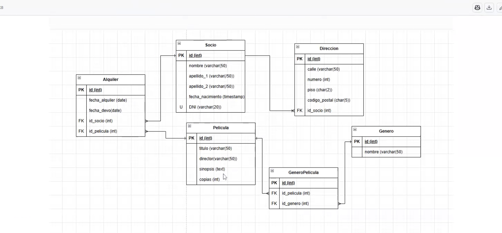

# SQL Modeling Project

## Project Description

The goal of this project is to design and create a database that meets the following requirements:

1. We need to register the video club members. At minimum, we require their first and last names, date of birth, phone number, and their identification number (DNI, Passport, or whatever it’s called in your country). We will assign them a membership number to make membership cards (apparently your cousin is still stuck somewhere in the ‘90s).

2. We need to record the members’ mailing address for potential advertising campaigns, though providing this information is not mandatory. A postal code, street name, house or building number, and apartment number (if applicable) is sufficient. We assume it will be in the same city where the video store is located.

3. We need to record the movies. We can have more than one copy of each. For each movie, we need to store the title, genre, director, and synopsis.

4. We need to know which member borrowed each copy and when. In other words, we must record the date it was checked out and the return date. If a movie does not have a return date, we consider it currently loaned out.

5. For practical purposes, we frequently need to check which movies are available for rent at any given time (i.e., not loaned out). We need to know the title of the movie and the number of available copies.

---
## Entity-Relationship Diagram

---

## Credits

- Author: Flavia Garbetta

- Referenced Resources: 
[https://www.postgresql.org/docs/current/datatype.html](https://www.postgresql.org/docs/current/datatype.html)